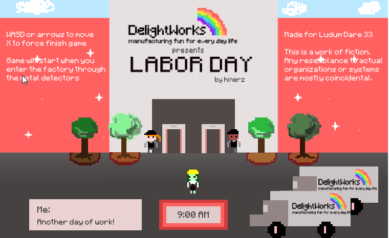
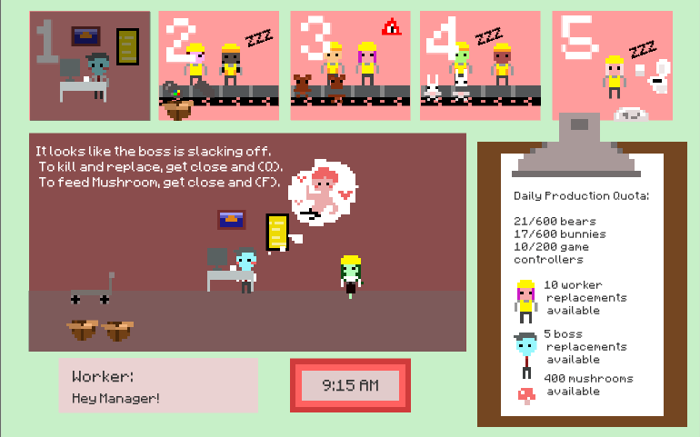

+++
date = "2015-08-25T20:29:45-04:00"
draft = false
title = "You are the monster: Labor Day"
tags = ["blog", "projects", "games"]
+++

Ludum Dare 33's theme was "You are the Monster".

With a theme like “You are the Monster”, and Labor Day in mind (I’m already excited for my 3 day weekend) I couldn't help but to remember recent controversies with Amazon– shedding light also to the warehouse worker conditions.

I don’t want to be too literal or heavyhanded. My goal is to make a small, cute game that has some satirical quality. Valentines Day was a quirky game that made a reductionist statement about love and money. This time, I did something similar. It’s not easy being a operations manager, I can imagine, and things might get out of hand.

Recently, I also made a game called “Slinging Ink”, which was a multiplayer game between two players during 4 minutes (9-5pm, each minute being 2 hours) so the game was through a workday. I wanted to do that again. It added some interesting aspects to the game.

A quote struck out to me from one of the articles I was reading “He claimed there was 500 visible cameras and over 500 more you could not see in the warehouse. They even had to install them in the break room because people’s lunches were getting stolen. He yammered on and on about how you will never get away with stealing so please don’t try.”

So I made a game that is a extreme take on this: multiple cameras, a ubiquitous “warehouse manager”, a few panels on the top showing a thumbnail of the warehouse’s condition, you can flip between and react with what things that may be happening: stealing, laziness, etc.

Backstory: 
There are cameras everywhere at DelightWorks toy factory, even the restroom. The manager, Miz, is also ubiquitous, she can go make sure everyone can do their work properly. Unfortunately, some workers steal. Some just slack off. But Miz is there to make sure that they are corrected. 
Mushrooms are great for motivating tired workers. It even works for the Boss, who is apparently addicted to watching distracting things on his computer. 

This game *is* totally dark and messed up and I'm kind of unapologetic about it.

Ratings from the jam:

#122	Humor(Jam)	3.68

#150	Innovation(Jam)	3.57

#302	Mood(Jam)	3.42

#434	Fun(Jam)	3.18

#485	Graphics(Jam)	3.48

#489	Overall(Jam)	3.25

#519	Theme(Jam)	3.46

Ludum Dare page [here](http://ludumdare.com/compo/ludum-dare-33/?action=preview&uid=39435), itch.io link [here](https://hinerz.itch.io/labor-day).