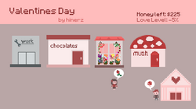
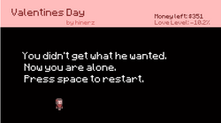
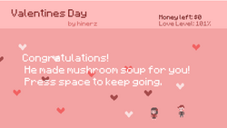

+++
date = "2015-03-12T20:29:45-04:00"
draft = false
title = "Game of Love and Money"
tags = ["blog", "projects", "games"]
+++

This is going to be a quick one. 
In our Art 178 class we made a "quick loop" game.
My quick loop was the following:
boyfriend says he wants something --> player works, makes money, buys it for him --> boyfriend is happy and gives love

Yes, super strange and reductionalist. Oh well!

Eventually I added more features to the game by adding win/lose conditions:
- Win love by money
- Make money by working
- Working too much will disinterest your love
- Buying something your lover doesn't want will also diminish your love
- Being in debt will also lead to your lover leaving

So it's sort of a balancing act of sorts. Still super simple. 