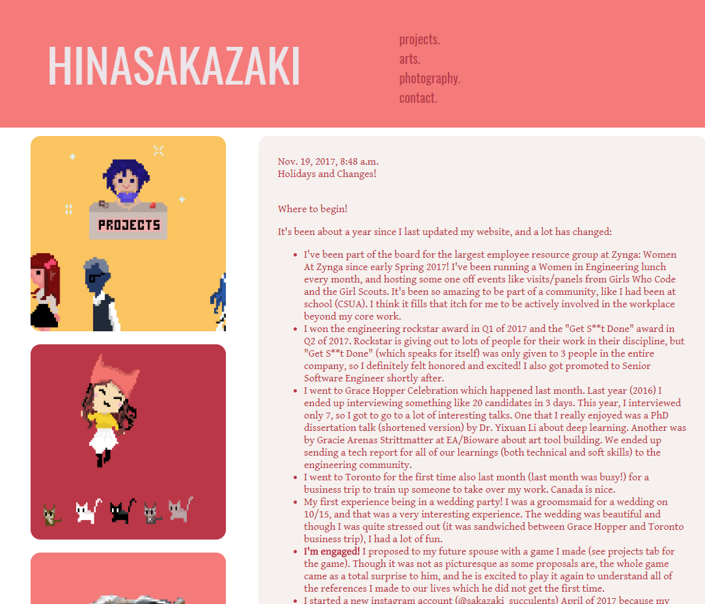
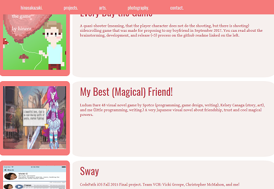

+++
date = "2018-03-01T20:29:45-04:00"
draft = false
title = "New Website!"
tags = ["blog", "projects"]
+++

I got sick of my old handmade frontend design, Django backend, so I decided to use [Hugo](https://gohugo.io/) to make my static website. I used the [hugo-geo](https://github.com/alexurquhart/hugo-geo) template. 
It was super easy and quick, and so much prettier. I highly recommend it!

Some screenshots of my old website:

I did enjoy the thumbnails for my projects, so I can see if I can do that here, too, [itch.io](https://hinerz.itch.io/) style.